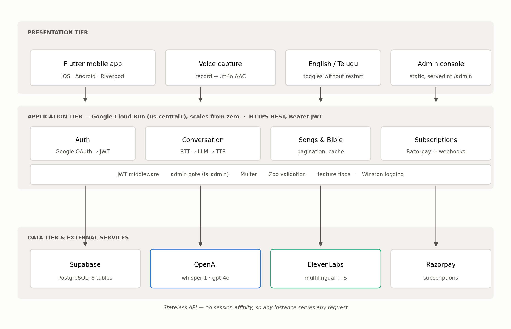
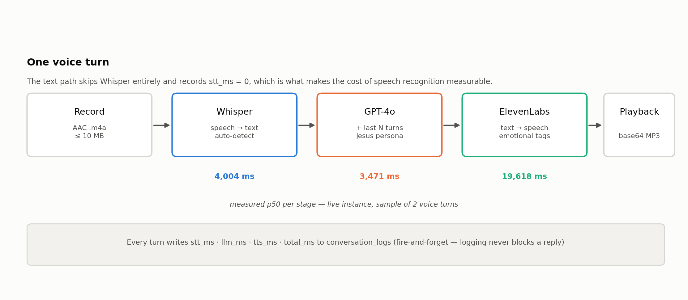
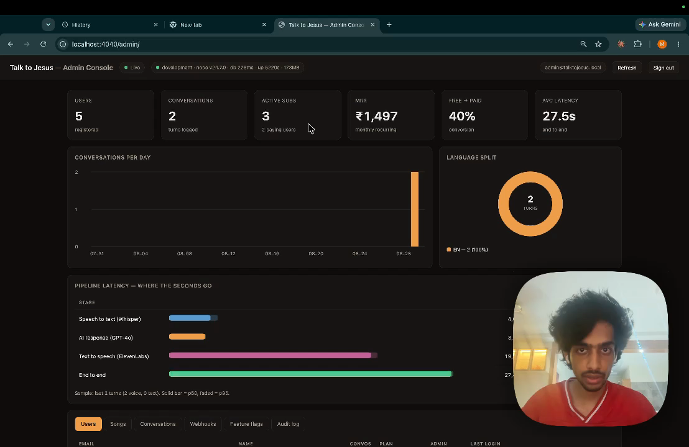
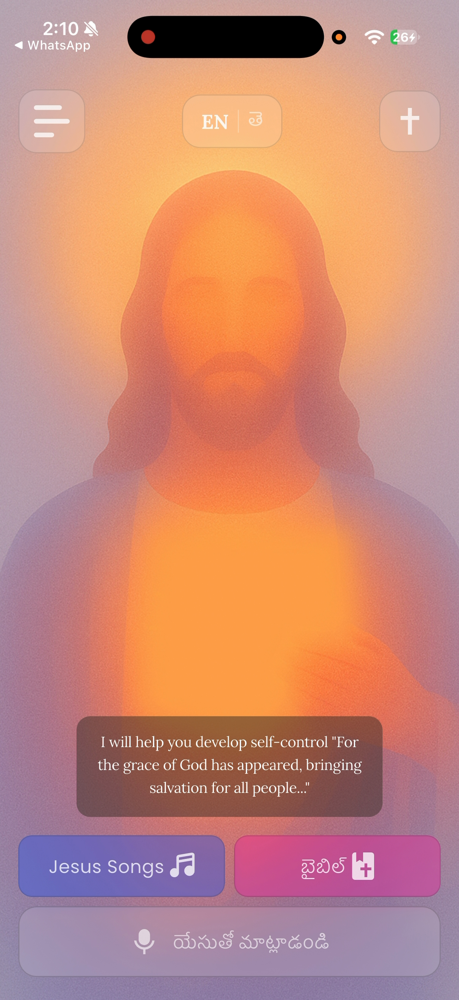
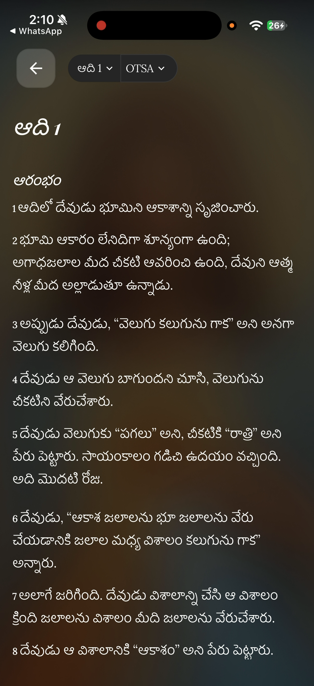
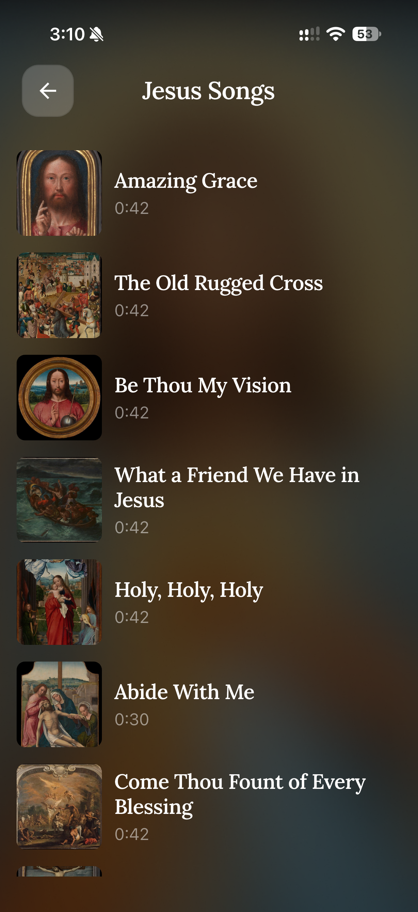
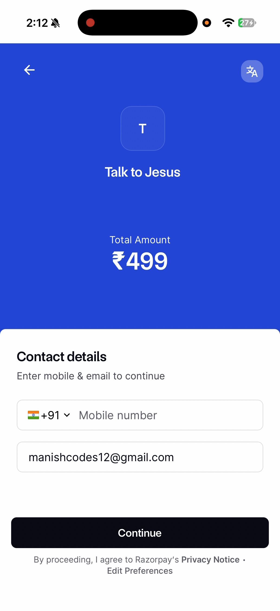

# CHAPTER 2: IMPLEMENTATION DETAILS

## 2.1 System architecture and design

### 2.1.1 High-level architecture

The system is a conventional three-tier deployment. The distribution of responsibility across the tiers is worth stating explicitly, because one decision in the data tier propagates through everything above it.



The **presentation tier** is the Flutter application, plus the administrative console, which is a single 995-line HTML file with no build step and no external dependencies. Both authenticate with a bearer token and speak the same REST API.

The **application tier** is a stateless Express 5 service on Node 20, deployed to Cloud Run in `us-central1` and configured to scale from zero. Statelessness is not incidental: because no session state is held in process memory, any instance can serve any request, which is what permits scale-to-zero without a shared cache.

The **data tier** is Supabase-hosted PostgreSQL across eight tables, together with OpenAI, ElevenLabs and Razorpay.

The consequential decision is that the API authenticates to PostgreSQL with a service-tier key. Row-level security is enabled on every table, but the service-tier key bypasses it by design. **Authorization is therefore enforced entirely in application code**, not by the database. Every endpoint that returns user-scoped data must filter by the authenticated user's identifier itself, because the database will not do it. Section 2.4.5 examines the consequence.

### 2.1.2 Data flow — speech to spoken reply



A voice turn proceeds as follows.

1. The user presses the voice bar. The client checks microphone permission and handles four distinct outcomes — granted, denied, permanently denied, restricted — with a specific dialog for each; the permanently-denied case offers to open system settings.
2. Recording begins. The client captures AAC-LC at 128 kbps, 44.1 kHz, mono, into an `.m4a` file in the temporary directory. The user sees a pulsing indicator with a cancel control and a stop control.
3. On stop, the file is uploaded as `multipart/form-data` to `POST /api/conversation/send-message` along with a language field. Uploads are capped at 10 MB and restricted by MIME type.
4. The API authenticates the bearer token, then checks entitlement: the turn proceeds if the user's conversation count is below the free-tier limit or if a subscription is active. Otherwise the request is refused with HTTP 402.
5. Whisper transcribes the audio. The language parameter is deliberately **not** passed to Whisper, which auto-detects instead; Section 2.4.2 explains why.
6. The previous turns are loaded from the database and folded into the message array, and GPT-4o generates a reply under the language-specific persona prompt.
7. ElevenLabs synthesises the reply. The audio is returned as a base64 data URI.
8. The client decodes the audio to a temporary file, plays it, displays the text, and deletes the temporary file.

Each of steps 5, 6 and 7 is timed independently, and all four durations are written to the database after the response has been returned to the client.

### 2.1.3 Component interaction — authentication and entitlement

Two gates stand in front of a conversational turn, and they answer different questions.

**Authentication** answers "who is this?". The client obtains a Google ID token and posts it to `/api/auth/create-or-get-user`. The server verifies the token against three OAuth client identifiers in sequence — web, iOS and Android — because a single application distributed on two platforms plus a web console legitimately presents tokens minted for three different audiences. On success the user row is created or its last-login timestamp updated, and the server mints its own HS256 JWT with a seventy-day expiry.

**Entitlement** answers "may this user do this?". It is evaluated per turn, not per session, because a user's free-tier allowance is consumed during a session.

A third gate applies only to administrative routes. It reads `is_admin` from the user record already loaded by the authentication middleware, requires the value to be strictly `true`, and — when it fails — returns **404, not 403**. Returning "not found" rather than "forbidden" avoids confirming to an unauthenticated prober that the administrative surface exists at that path.

## 2.2 Technology stack

Table 3 — Technology stack and rationale

| Layer | Technology | Version | Rationale |
|---|---|---|---|
| Mobile framework | Flutter / Dart | 3.38.6 / 3.9 | One codebase for iOS and Android; the audio recording and playback packages are mature |
| Mobile state | Riverpod | 2.5 | Compile-time safe providers; no `BuildContext` dependency for business logic |
| Mobile local store | sqflite | 2.4 | Offline Bible cache with a least-recently-used eviction policy |
| Mobile HTTP | package:http | 1.5 | A single hand-written client was simpler than configuring an interceptor stack for ten endpoints |
| Backend runtime | Node.js | 20 LTS | Long-term support; matches the Cloud Run base image |
| Backend framework | Express | 5.1 | Minimal, well understood, adequate for 28 routes |
| Backend language | TypeScript | 5.9 | `strict` mode; compilation doubles as a typecheck gate in CI |
| Validation | Zod | 4.1 | Schema validation that also produces the TypeScript type |
| Database | Supabase (PostgreSQL) | — | Managed Postgres with an SDK; no ORM was introduced |
| Identity | Google OAuth 2.0 + JWT | — | Users already have a Google account; no password storage |
| Speech to text | OpenAI Whisper | `whisper-1` | Strong Telugu recognition; automatic language detection |
| Generation | OpenAI GPT-4o | `gpt-4o` | Instruction-following adequate to hold a persona across a long system prompt |
| Speech synthesis | ElevenLabs | multilingual | Telugu voice quality; supports inline emotional direction |
| Payments | Razorpay | 2.9 | Subscription primitives and UPI support for the Indian market |
| Container platform | Google Cloud Run | — | Scales to zero; the workload is bursty and mostly idle |
| Build & deploy | Docker + Cloud Build | — | Multi-stage image; deploys on push to `main` |
| Continuous integration | GitHub Actions | — | Builds and tests both tiers plus the container image |
| Error tracking | Sentry | 9.6 | Crash and error capture with session replay |
| Product analytics | PostHog | 5.5 | Event tracking |
| Logging | Winston + Morgan | 3.18 | Structured logs with per-environment levels |

## 2.3 System modules

### 2.3.1 Authentication module

Three source files carry this module: the auth service, the JWT utility and the authentication middleware. The service iterates the three configured Google client identifiers and accepts the first that verifies; if none do, the login fails. The user record is then upserted by email address — updating `last_login_at` if the row exists, inserting it if not — and a token is signed.

The seventy-day expiry is a deliberate trade against security. A devotional application that demands re-authentication weekly will be abandoned; one that never expires a token cannot revoke it. Seventy days is the compromise, and it is a weakness recorded in Section 3.8.

### 2.3.2 Conversation module

This module is the system. It exposes three endpoints — a voice turn, a text turn and a paginated history — and the two turn endpoints share a single `generateReply` helper that differs only in whether transcription runs.

The shared helper loads the feature flags, conditionally loads the previous turns, selects the system prompt for the requested language, calls the model under a timer, conditionally synthesises speech under a second timer, dispatches a fire-and-forget write of all four timings, and returns.

The word *conditionally* is doing real work in that sentence. If speech synthesis is disabled by flag, or if the ElevenLabs call fails, the synthesis function returns `null` rather than raising, and the user receives a text-only reply instead of an error. If the context feature is disabled, the model is called with no history. The pipeline degrades in stages rather than failing outright.

### 2.3.3 Prompt engineering

The persona lives in a roughly ninety-line system prompt parameterised on language. It specifies the reply language, the form of address, the vocabulary of emotional tags available to the synthesiser with worked examples in both languages, a four-part response structure, a two-to-four sentence length target, and a set of safety constraints: defer to human pastoral care for matters of crisis, introduce no new revelation, and stay within orthodox doctrine.

The length target is not honoured in practice. Figure 8 shows a reply running to three paragraphs. Section 3.7 records this as a defect, and Section 3.5 connects it directly to the latency result — synthesis time scales with output length, and the model is producing four to five times the specified length.

### 2.3.4 Subscription and payments module

A subscription is created against Razorpay with a twelve-cycle count and persisted locally. Reading the current subscription refreshes it from Razorpay first and falls back to the stored row if that call fails, so a Razorpay outage degrades to stale data rather than an error.

Webhooks are the reconciliation path. Ten `subscription.*` event types are handled. Every webhook — valid or not — is recorded to an audit table along with the boolean result of its signature check.

### 2.3.5 Bible module

The Bible reader is served by a third-party public API at `bible.helloao.org`, not by this project's backend. It provides sixty-six books across six translations, two of them Telugu. The client wraps it with a thirty-second timeout, three retries with backoff, a connectivity pre-check and a SQLite cache. Reading position is saved per book and translation and restored on return.

### 2.3.6 Hymn library module

Twelve public-domain hymns are bundled with the application as approximately forty-second excerpts at 64 kbps mono, each with a public-domain painting as artwork. The songs endpoint returns a server-managed catalogue; if it returns nothing or fails, the client falls back to the bundled set, so the library works with no network at all.

The licensing of these assets carries an obligation the application does not currently meet; Appendix E and Section 3.8 record it.

### 2.3.7 Administrative console

The console is one HTML file with inline styles and inline JavaScript. It has no build step, no framework and no content-delivery-network dependency — a deliberate choice so that a venue's network cannot blank the dashboard during a demonstration. Charts are hand-drawn inline SVG for the same reason.

It presents six stat cards, a conversations-per-day chart, a language split, the per-stage latency breakdown, and six tabs: users, songs, conversations, webhooks, feature flags and the audit trail. It also ships a demonstration mode that serves fixtures entirely client-side behind a visible `DEMO DATA` badge. That mode is the origin of the latency discrepancy discussed in Section 3.5.



### 2.3.8 Feature flag module

Five flags are stored in a `feature_flags` table and read on every conversational turn behind a fifteen-second in-process cache. Reads never raise; on any error the module returns compiled-in defaults.

Table 6 — Runtime feature flags

| Key | Default | Effect |
|---|---|---|
| `free_tier_limit` | 3 | Conversations allowed before the paywall |
| `maintenance_mode` | false | Refuses conversational turns with a friendly message |
| `tts_enabled` | true | When false, replies are text-only |
| `multi_turn_enabled` | true | When false, each turn is generated without history |
| `multi_turn_window` | 6 | How many previous turns are supplied as context |

## 2.4 Key algorithms and logic

### 2.4.1 The timed pipeline

The instrumentation is the point, so the ordering matters.

```
FUNCTION generateReply(user, text, language):
    flags   ← getFeatureFlags()              -- 15 s cache, never raises
    IF flags.maintenance_mode: ABORT 503

    history ← []
    IF flags.multi_turn_enabled:
        history ← getRecentTurns(user.id, flags.multi_turn_window)

    t0 ← now()
    reply ← callOpenAI(text, systemPrompt(language), history)
    llm_ms ← now() - t0

    audio, tts_ms ← null, 0
    IF flags.tts_enabled:
        t1 ← now()
        audio ← generateSpeech(reply)        -- returns null on failure
        tts_ms ← now() - t1

    logConversationTurn(...)                 -- fire and forget, not awaited
    RETURN reply, audio, llm_ms, tts_ms
```

Two properties are deliberate. The log write is dispatched without being awaited and swallows its own errors, so instrumentation can never slow or break a reply. And `generateSpeech` returns `null` rather than raising, so a synthesis failure costs the user their audio but not their answer.

### 2.4.2 Language handling

The language parameter selects the system prompt and the emotional-tag vocabulary. It is **not** forwarded to Whisper.

The reason is code-switching. A Telugu speaker asking a question about a software project will say "capstone project" and "computer science" in English inside a Telugu sentence — Figure 8 shows exactly this pattern. Pinning Whisper to Telugu degrades those English tokens; auto-detection handles the mixture better. The cost is that a user who has selected Telugu but speaks English will be transcribed as English and receive a Telugu reply, because the prompt language and the detected language are independent. This is accepted behaviour, not a defect.

### 2.4.3 Emotional tag mapping

ElevenLabs accepts inline bracketed direction such as `[gently]` or `[prayerfully]`. The synthesis service checks whether the model's output already carries such tags. If it does, they pass through. If not, the service inspects the text for Telugu keywords and prepends matching tags — for instance ప్రేమ or బిడ్డ maps to a loving and caring register, ప్రార్థన or ఆశీర్వాద to a prayerful and reverent one — defaulting to `[warmly] [gentle]`.

These tags are markup for the speech engine. They are not intended for display. Section 3.7 records that they are nevertheless displayed.

### 2.4.4 Multi-turn context

This is the mechanism that most invites overstatement, so it is stated plainly.

```
FUNCTION getRecentTurns(userId, limit):
    rows ← SELECT user_message, assistant_text FROM conversation_logs
           WHERE user_id = userId
           ORDER BY created_at DESC LIMIT limit
    RETURN reverse(rows)                     -- oldest first, as the model expects
```

Those turns are flattened into alternating user and assistant messages and prepended to the current message. **There is no retrieval, no embedding, no vector index and no semantic search.** The system does not retrieve relevant scripture; the model produces citations from its own parameters. Describing this as retrieval-augmented generation would be inaccurate, and the distinction matters for any assessment of whether citations can be trusted — Section 3.8 records that citation accuracy was not verified.

The function returns an empty list on any error, so a database problem costs context but not the conversation.

### 2.4.5 Entitlement resolution

The paywall is more involved than a boolean because payment providers are eventually consistent.

```
FUNCTION hasActiveSubscription(userId, freeLimit):
    user ← SELECT conversation_count FROM users WHERE id = userId
    IF user.conversation_count < freeLimit: RETURN true    -- free tier

    subs ← SELECT * FROM subscriptions WHERE user_id = userId
    best ← pick by status priority: active > authenticated > created

    CASE best.status:
        'active':        RETURN true
        'authenticated': RETURN true         -- mandate approved, first charge pending
        'created':       RETURN (now - best.created_at) < 24 hours
        otherwise:       RETURN false
```

The twenty-four-hour grace period on `created` exists because a user who has completed checkout may reach the application before Razorpay's webhook does. Without it, a paying user would be refused service in the seconds after paying. With it, an abandoned checkout grants a day of unpaid access. The trade favours the paying user, and Section 3.8 records the cost.

Note also that `incrementConversationCount` is a read-modify-write without a database-level atomic increment, so two truly concurrent turns from one account can lose an increment. Section 3.7 records this.

### 2.4.6 Webhook signature verification

```
FUNCTION verifySignature(rawBody, receivedSignature, secret):
    expected ← HMAC_SHA256(rawBody, secret)
    IF length(expected) ≠ length(receivedSignature): RETURN false
    RETURN timingSafeEqual(expected, receivedSignature)
```

The length check precedes the comparison because `timingSafeEqual` raises on unequal lengths rather than returning false. The comparison itself is constant-time, so response timing does not leak how much of a forged signature was correct.

Every webhook is recorded whether or not it verifies. Recording the failures is what makes it possible to demonstrate that verification is running — an audit table containing only successes is consistent with a system that never checks.

## 2.5 Screenshots










