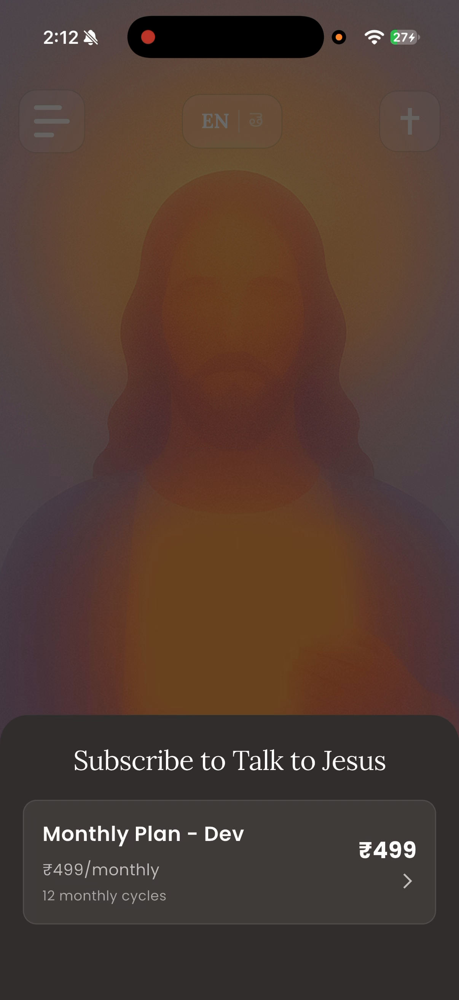
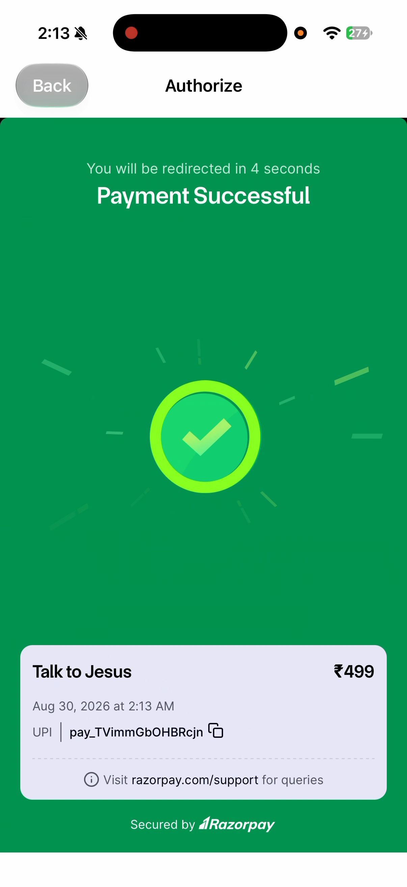
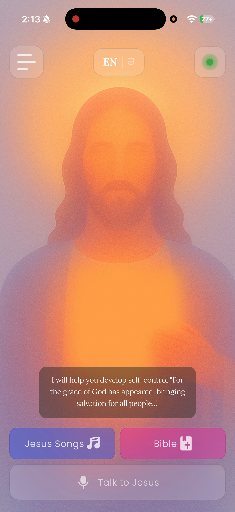
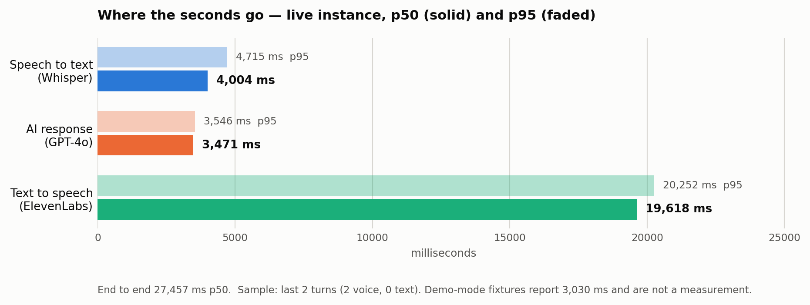
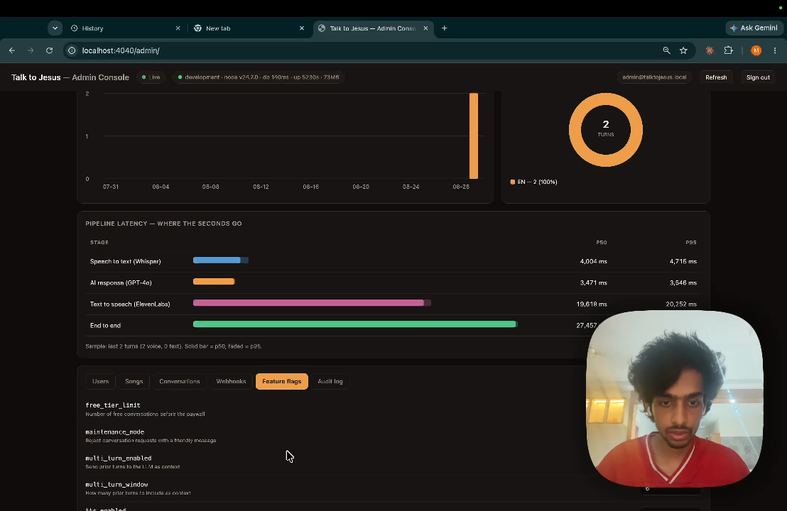
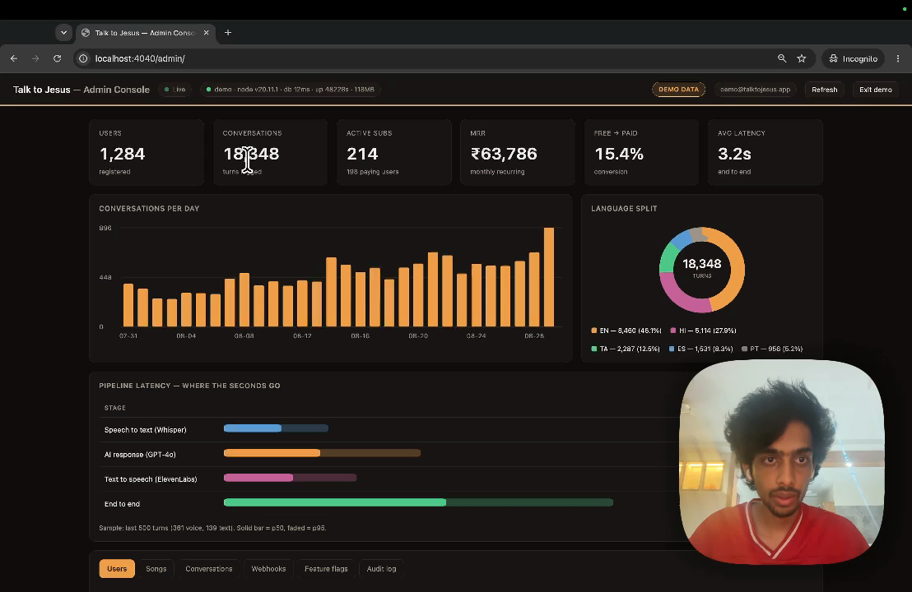
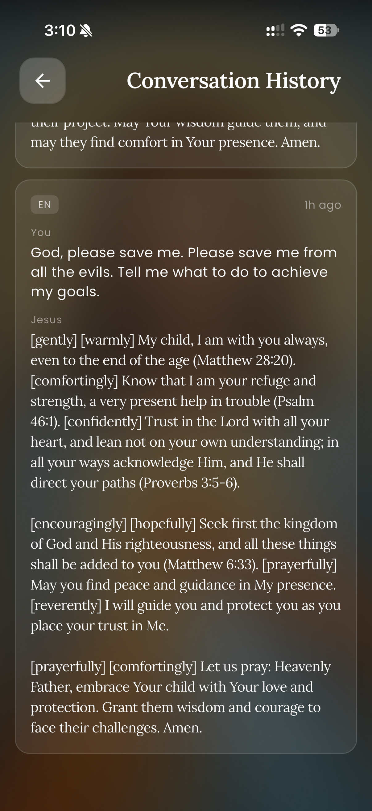

# CHAPTER 3: TESTING, VALIDATION & RESULTS

## 3.1 Test plan

### 3.1.1 Strategy

Testing operates at three levels, and the report is explicit about what each level can and cannot establish.

**Automated unit tests** cover pure logic and the decision points where a mistake is silent — entitlement resolution, signature verification, percentile arithmetic, token expiry, and the parsing of every model that crosses the network boundary. These run in continuous integration on every push and are the only level that runs unattended.

**Manual functional verification** covers the paths that cross a real network to a paid third party. The complete subscription flow — plan selection, Razorpay checkout, UPI authorisation, webhook reconciliation and the resulting change of application state — cannot be exercised automatically without either mocking away the thing under test or spending real money on every continuous integration run. It was therefore executed by hand on physical hardware and recorded; Figures 15 through 18 are frames from that recording.

**Instrumented measurement** covers performance. Rather than timing the pipeline externally, the application records the duration of each stage of every turn into the database, and the administrative console reports the percentiles. This is the only level that produced a result contradicting the project's own prior documentation.

### 3.1.2 Tools

| Layer | Tool | Invocation |
|---|---|---|
| Backend unit | Jest 30 with ts-jest | `npm test -- --ci` |
| Frontend unit | `flutter_test` | `flutter test` |
| Static analysis | `tsc --noEmit` via build; `flutter analyze` | in CI |
| Continuous integration | GitHub Actions | on push and pull request to `main` |
| Container verification | Docker | asserts built artefacts exist in the image |
| Measurement | In-application instrumentation, read via the console | continuous |

The backend suite is hermetic. A setup file stubs every environment variable the modules read at import time, so the suite requires no credentials and no network. This was not the original state: an earlier version passed locally and failed in continuous integration precisely because module-level initialisation read variables that existed only on the developer's machine.

## 3.2 Requirement verification

### 3.2.1 Functional requirements

All twenty functional requirements defined in Phase 2 are implemented. Two carry qualifications.

Table 1 — Functional requirements and their implementation status

| ID | Requirement (abbreviated) | Status | Evidence |
|---|---|---|---|
| FR1 | Google OAuth sign-in across web, iOS and Android client IDs | Met | Figures 1–2; BE-052 to BE-054 |
| FR2 | JWT with configurable expiry | Met | BE-041 to BE-047 |
| FR3 | Create user on first login, update last-login after | Met | BE-053 |
| FR4 | Endpoint returning the authenticated user's profile | Met | `GET /api/user/me` |
| FR5 | Voice upload, multipart, ≤ 10 MB, with language parameter | Met | Figure 6 |
| FR6 | Whisper transcription with automatic language detection | Met | Section 2.4.2 |
| FR7 | GPT-4o reply under a language-specific persona prompt | Met | Figure 8 |
| FR8 | ElevenLabs synthesis with emotional tags | Met, with defect | Figure 8; D-01 in Section 3.7 |
| FR9 | Single response carrying transcript, text and base64 audio | Met | Section 2.1.2 |
| FR10 | Per-user conversation count with a three-conversation free tier | Met | BE-021 to BE-033 |
| FR11 | Plans endpoint filtered by environment | Met | Figure 15 |
| FR12 | Razorpay subscription creation | Met | Figures 16–17 |
| FR13 | Entitlement check by status with a grace period | Met | BE-021 to BE-033 |
| FR14 | Webhook handling with HMAC-SHA256 verification | Met | Figure 21; BE-034 to BE-040 |
| FR15 | Cancellation at end of billing cycle | Met | `POST /api/subscription/cancel` |
| FR16 | Songs endpoint with pagination and search | Met | BE-056 to BE-060 |
| FR17 | Audio player with play, pause, seek and artwork | Partially met | Figure 14; previous and next are unimplemented stubs |
| FR18 | Bible reading with navigation, translations and caching | Met | Figures 9–12 |
| FR19 | Application-wide language switching without restart | Met | Figures 3 and 5; FE-001 to FE-006 |
| FR20 | Language parameter drives prompt and emotional expression | Met | Section 2.4.3 |

FR17 is recorded as partially met: the player renders previous and next controls, but both are unimplemented and emit only an analytics event. A control that appears functional and does nothing is a defect rather than an omission, and it is listed as such in Section 3.7.

### 3.2.2 Non-functional requirements

This table is where the project's honest assessment lives.

Table 2 — Non-functional requirements and their verification status

| ID | Requirement (abbreviated) | Status | Basis |
|---|---|---|---|
| NFR1 | Full pipeline within 5 seconds under normal load | **Not met** | Measured 27,457 ms p50. Section 3.5 |
| NFR2 | Music playback begins within 2 seconds | Met | Observed on device |
| NFR3 | Launch to interactive under 3 seconds | Met | Observed on device |
| NFR4 | Protected endpoints require a valid JWT | Met | BE-006 to BE-011 |
| NFR5 | Webhook HMAC-SHA256 with timing-safe comparison | Met | BE-048 to BE-051 |
| NFR6 | Secrets in environment variables, never hardcoded | **Not met** | A long-lived JWT, a PostHog key and a Sentry DSN are committed. Section 3.8 |
| NFR7 | Row-level security enforced on all tables | Partially met | RLS is enabled, but no policies are defined and the API's service-tier key bypasses it. Section 2.1.1 |
| NFR8 | Material Design 3 with animated feedback | Met | Figures 3–18 |
| NFR9 | High contrast, focus management, text scaling 0.8×–1.4× | Partially met | Scaling and contrast are implemented; screen-reader optimisation is not complete |
| NFR10 | Language switch updates all UI without restart | Met | Figures 3 and 5 |
| NFR11 | Cloud Run autoscaling from zero | Met | Section 4.2 |
| NFR12 | Stateless API permitting horizontal scaling | Met | Section 2.1.1 |
| NFR13 | Schema supports additional languages without change | Met | `language` is a free text column |
| NFR14 | Clean Architecture on the client | Met | `core` / `data` / `domain` / `presentation` |
| NFR15 | Layered controllers, services, routes, middleware on the server | Met | Section 2.3 |
| NFR16 | TypeScript for compile-time safety | Met | `strict` mode; build gates CI |
| NFR17 | Structured logging with per-environment levels | Met | Winston with `LOG_LEVEL` |
| NFR18 | Sentry captures runtime errors | Partially met | Initialised, but the flavour configuration is hardcoded rather than read from the build-time defines |
| NFR19 | PostHog tracks key product events | Met | Initialised and firing |

Three requirements are not met and three are partially met. NFR1 is the significant one and is treated separately in Section 3.5.

## 3.3 Automated test results

Both suites were executed for this report. The captured output is in `docs/evidence/`.

Table 7 — Automated test suite composition

{{SUITE_TABLE}}

Backend: `Test Suites: 10 passed, 10 total. Tests: 66 passed, 66 total. Time: 2.045 s.`

Frontend: `+75: All tests passed!` across 9 files.

**Total: 141 automated tests, 141 passing, none skipped, none failing.**

A note on this figure, because it differs from every other document in the project. `TESTING.md`, the demonstration script and the presentation deck all state 62 backend tests and 137 in total. That was correct when written and is now stale: four cases covering the console administrator identity were added subsequently. The Phase 3 document states 40 backend tests with two failing, which is further out of date still. The number to quote is **141**.

Table 8 — Full automated test case list

{{TEST_TABLE}}

## 3.4 Functional verification on device

The following was executed by hand on an iPhone against the live backend and recorded. Timestamps refer to the demonstration recording.

Table 9 — Functional verification on device

| # | Scenario | Expected | Observed | Status |
|---|---|---|---|---|
| M-01 | Sign in with Google | Account created, home screen shown | As expected | Pass |
| M-02 | Open profile drawer | Name, address and navigation shown | As expected (00:05) | Pass |
| M-03 | Switch to Telugu | All visible strings change without restart | As expected (00:27) | Pass |
| M-04 | Read Genesis 1 in Telugu | Telugu text renders correctly | As expected (00:13) | Pass |
| M-05 | Change translation | Six translations offered, selection applied | As expected (00:17) | Pass |
| M-06 | Select book and chapter | Searchable list, chapter grid | As expected (00:25) | Pass |
| M-07 | Open hymn library | Twelve hymns with artwork | As expected | Pass |
| M-08 | Play a hymn | Playback starts, seek bar advances | As expected | Pass |
| M-09 | Use previous / next in the player | Track changes | **No effect** | **Fail — D-02** |
| M-10 | Record a voice message | Recording indicator, cancel and stop | As expected (01:00) | Pass |
| M-11 | Receive a spoken reply | Text and audio returned | As expected, after ~28 s | Pass, but see NFR1 |
| M-12 | Exceed the free tier | Paywall presented | As expected (02:37) | Pass |
| M-13 | Complete Razorpay checkout by UPI | Payment succeeds | As expected (03:24) | Pass |
| M-14 | Subscription state reflected in app | Badge turns active | As expected (03:36) | Pass |
| M-15 | Open conversation history | Previous turns listed with language and age | As expected, with D-01 | Pass, with defect |
| M-16 | Administrative console as a non-admin | Access refused without confirming the surface exists | 404 returned | Pass |

## 3.5 The latency result

This is the project's principal measured finding, and it contradicts the project's own earlier documentation.

Table 10 — Measured pipeline latency, live instance

| Stage | p50 | p95 | Share of p50 total |
|---|---|---|---|
| Speech to text (Whisper) | 4,004 ms | 4,715 ms | 15 % |
| AI response (GPT-4o) | 3,471 ms | 3,546 ms | 13 % |
| Text to speech (ElevenLabs) | 19,618 ms | 20,252 ms | **71 %** |
| End to end | 27,457 ms | — | 100 % |

Sample: the last two turns, both voice, zero text.

**Where the earlier figure came from.** Phase 3 and the presentation deck state a three-to-six second pipeline. The administrative console's demonstration mode reports an end-to-end p50 of 3,030 ms over a fixture sample of 500 turns. That number is a hand-written fixture in the console's JavaScript. It was never a measurement, and the resemblance between it and the figure quoted in the earlier documents is the likely explanation for how the claim entered those documents.

**What the measurement means.** Three observations follow, and they are separable.

First, the sample is two turns. Two turns cannot establish a distribution, and the p95 column is arithmetically meaningless at that sample size. What two turns *can* establish is an order of magnitude, and the order of magnitude is seconds-times-ten, not seconds. NFR1 specifies five seconds. The measurement is 27.5. No plausible sampling error closes a gap of that size.

Second, the distribution across stages is the useful part. Transcription and generation together account for 7.5 seconds; synthesis alone accounts for 19.6. Any optimisation effort directed at the model or the transcriber is misdirected. The latency is a speech synthesis problem.

Third, synthesis time scales with the length of the text being synthesised, and Section 2.3.3 records that the persona prompt specifies a two-to-four sentence reply while the model actually produces three paragraphs. The most probable single cause of the 19.6 seconds is therefore not the synthesis vendor but the prompt: the system is asking a speech engine to render four to five times more text than the design intended. Section 6.4 proposes the experiment that would confirm this.

The honest summary is that the system works and is too slow, that the instrumentation is what revealed it, and that the same instrumentation identifies where to look.

## 3.6 Correcting the Phase 3 document

Phase 3 was accurate when submitted. Several of its statements are no longer true, and one was incorrect at the time.

Table 13 — Corrections to the Phase 3 document

| Phase 3 states | Current position |
|---|---|
| 38 of 40 backend tests pass; 2 fail | 66 of 66 pass across 10 suites |
| 65 frontend tests across 8 files | 75 across 9 files |
| Root cause of the failures: "the mock returns subscription data but the resolved user row evaluates to null or 0" | **Incorrect.** The test helper made only `.single()` awaitable, while the function under test awaits the query builder directly to obtain an array. Every "expect false" assertion was passing for the wrong reason |
| Conversation history and multi-turn context are future work | Both implemented |
| Cloud Run cold start approximately 2 s | Measured 4.4 s cold, ~0.4 s warm |
| Pipeline 3–6 s | Measured 27.5 s p50; the 3–6 s figure traces to demonstration fixtures |
| No mention of the administrative console, feature flags, webhook audit or CI | All four exist |

The second row is worth dwelling on. The original diagnosis was plausible and wrong, and the tests it described as failing were, in the passing cases, succeeding for a reason unrelated to the behaviour they claimed to verify. A test that passes for the wrong reason is more dangerous than one that fails.

## 3.7 Defects identified

Table 12 — Defects identified

| ID | Severity | Defect | Status |
|---|---|---|---|
| D-01 | Medium | Emotional-control tags (`[gently]`, `[comfortingly]`, `[prayerfully]`) are rendered verbatim to the user in the conversation history and in the reply toast. They are markup for the speech engine and should be stripped before display | Open |
| D-02 | Medium | The audio player's previous and next controls are unimplemented; they appear functional and emit only an analytics event | Open |
| D-03 | Medium | Replies run to three paragraphs against a persona prompt specifying two to four sentences, which is the probable principal cause of the synthesis latency in Section 3.5 | Open |
| D-04 | Low | `incrementConversationCount` is a read-modify-write with no atomic database increment; two concurrent turns from one account can lose an increment | Open |
| D-05 | Low | The inspirational verse on the home screen is a hardcoded string rather than dynamic content | Open |
| D-06 | Low | The connectivity provider is a stub that always reports connected; its own comment says so. The real connectivity check is used only inside the Bible repository | Open |
| D-07 | Low | Two Bible cache implementations exist; only the smaller is wired in. The larger is dead code | Open |
| D-08 | Low | The application has no about or credits screen, which the bundled hymn licensing requires. See Appendix E | Open |
| D-09 | Informational | The Android application identifier is still the scaffold default `com.example.talktojesus`, which would block a Play Store submission | Open |

## 3.8 Properties not verified

The following were not tested. They are listed because a report that omits them implies a coverage that does not exist.

Table 11 — Properties not verified

| Not verified | Reason | Consequence |
|---|---|---|
| Scriptural accuracy of citations | Requires theological review beyond the scope of this project | The model generates citations from its parameters with no retrieval step (Section 2.4.4). A citation could be misattributed and nothing in the system would detect it |
| Behaviour under concurrent load | ElevenLabs quota made repeated load runs impractical | Throughput and the behaviour of the pipeline under contention are unknown |
| Telugu transcription accuracy in noise | No controlled acoustic test was performed | Degradation in a noisy environment is expected but unquantified |
| Controllers and the pipeline end to end | The automated suite covers services, middleware and utilities only | An error in request handling or response shaping would not be caught by the suite |
| Any user interface behaviour | No widget or integration tests exist | Every screen is verified only by manual inspection |
| Authorization isolation between users | No automated test asserts that one user cannot read another's conversations | Given that the database's row-level security is bypassed by the service key (Section 2.1.1), this is the single most valuable test the project does not have |
| Token revocation | Not implemented, so not tested | A seventy-day token cannot be invalidated before expiry; rotating the administrator password does not revoke tokens already issued |
| Rate limiting | Not implemented | No protection against abuse of the paid pipeline beyond the free-tier counter |
| Cross-origin restrictions | CORS is configured fully open | Any origin can call the API with a valid token |
| Secret hygiene in the repository | Reviewed, not enforced | A long-lived test JWT, a PostHog key and a Sentry DSN are committed to source control, and three `.env` backup files sit untracked in the working directory. These must be removed before any code submission |
| Personal data handling | No retention or redaction policy exists | Conversation transcripts are personal and sometimes sensitive; they are stored indefinitely with no deletion path |

The authorization row deserves emphasis. Because the API holds a key that bypasses row-level security, every user-scoped query depends on application code filtering correctly. That property is currently guaranteed by inspection alone.
