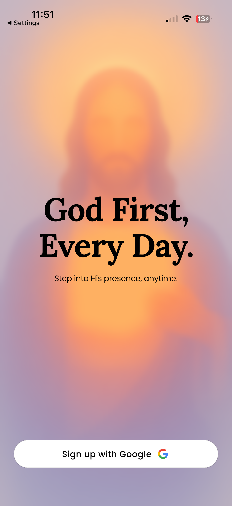
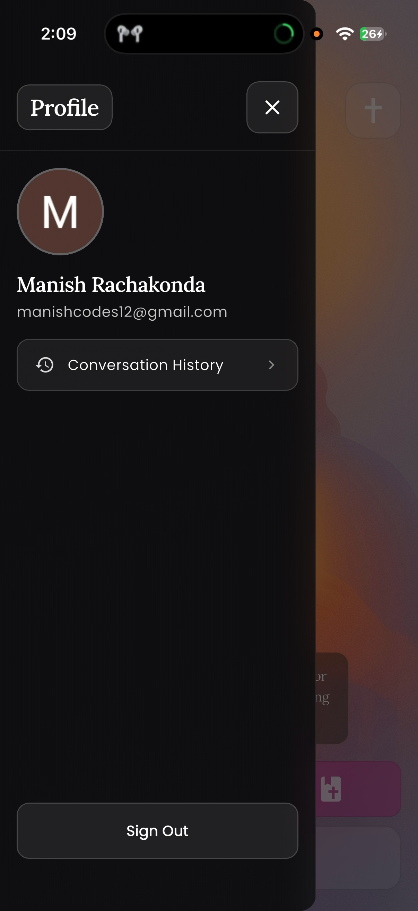
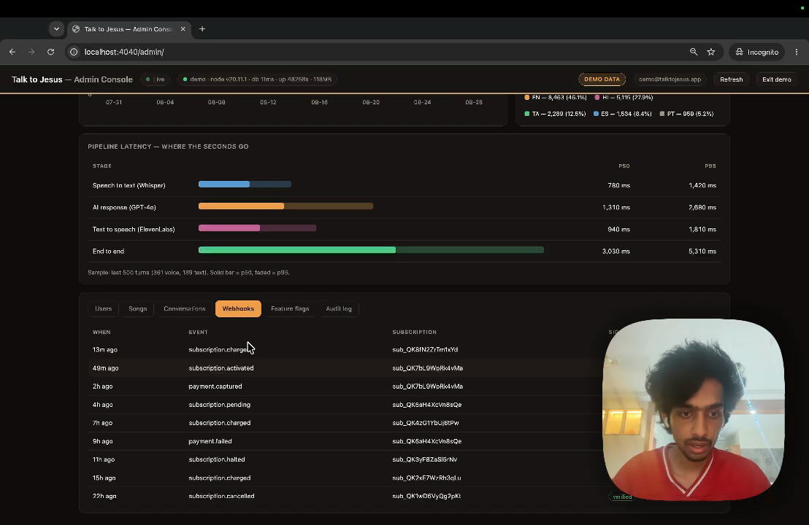
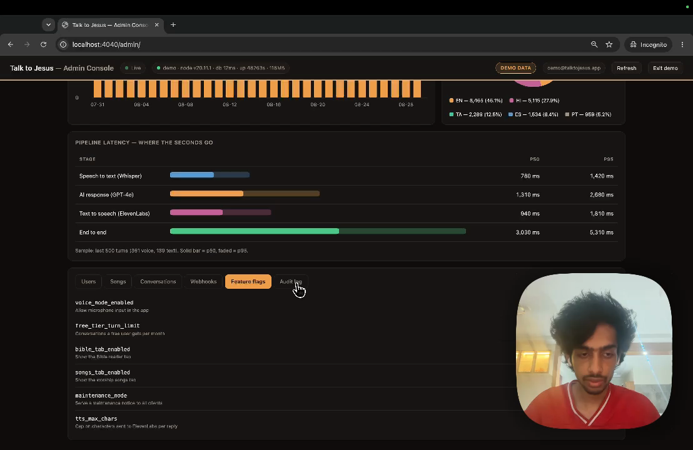
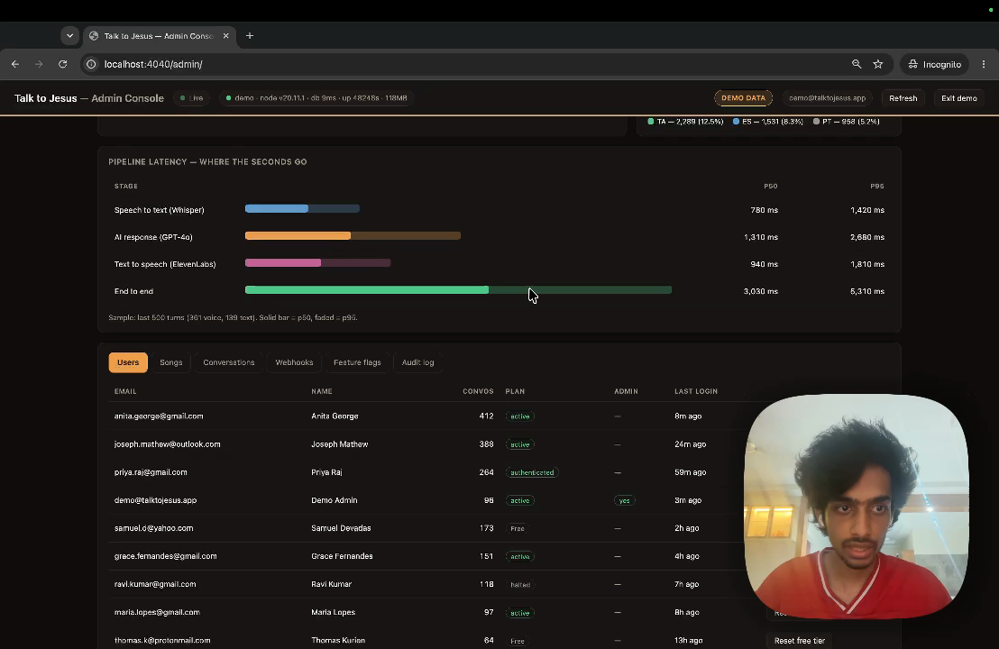
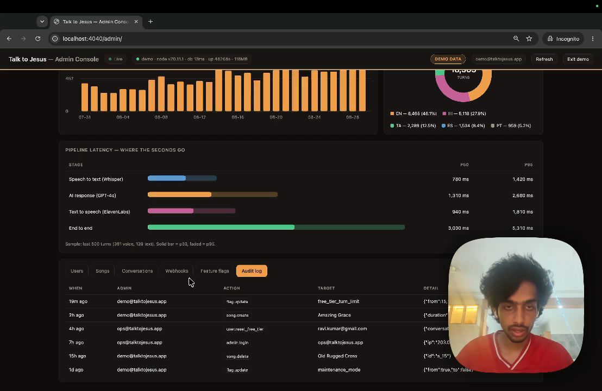

# CHAPTER 4: EXECUTION / DEPLOYMENT DETAILS

## 4.1 Execution environment

Table 14 — Execution environment

| Component | Configuration |
|---|---|
| Backend runtime, production | Node 20 on `node:20-alpine`, port 8080, `NODE_ENV=production` |
| Backend runtime, development | Node 24.7.0 on the development machine, port 4040 |
| Hosting | Google Cloud Run, service `talktojesus-backend`, region `us-central1`, scales from zero |
| Image registry | Artifact Registry, `us-central1-docker.pkg.dev/talktojesus-backend/cloud-run-source-deploy` |
| Build | Cloud Build, machine type `E2_HIGHCPU_8`, 1200 s timeout |
| Database | Supabase-hosted PostgreSQL, eight tables |
| Mobile toolchain, CI | Flutter 3.38.6 stable |
| Mobile toolchain, development | Flutter 3.32.7 |
| Continuous integration | GitHub Actions on push and pull request to `main` |

The two version skews are worth noting rather than hiding. The backend is developed on Node 24 and deployed on Node 20; the mobile application is built locally on Flutter 3.32.7 and in continuous integration on 3.38.6. Neither has produced a defect, but both are latent risks, and reconciling them is listed in Section 6.4.

## 4.2 Deployment steps

### 4.2.1 Continuous integration

`.github/workflows/ci.yml` runs three jobs on every push and pull request to `main`, with in-progress runs cancelled when a newer commit arrives.

**Backend.** Install with `npm ci`, compile with `npm run build`, then `npm test -- --ci`. Compilation is a deliberate gate: because the project is `strict`, a type error fails the build before any test runs. No secrets are required, because the test setup file stubs every environment variable read at import time.

**Frontend.** `flutter pub get`, then `flutter analyze --no-fatal-infos --no-fatal-warnings`, then `flutter test`. Five pre-existing analyzer notices are tolerated by that invocation and are recorded here rather than silently suppressed.

**Container.** Build the image, then assert inside it that both `/app/dist/index.js` and `/app/public/admin/index.html` are present. The second assertion exists because its failure mode — a 404 at `/admin` — is invisible until someone opens the console.

### 4.2.2 Continuous deployment

Deployment is Cloud Build: build the image without cache, verify the same two artefacts, push to Artifact Registry tagged with the commit SHA, then update the Cloud Run service.

There is deliberately **no test gate in the deployment pipeline**. Tests run in GitHub Actions in parallel. The reasoning is that a deployment blocked by a flaky suite is worse than a deployment that ships alongside a failing test which the parallel pipeline will report within a minute. This is a defensible trade but it is a trade, and it means a red build does not by itself prevent a release.

One further caveat, recorded because it would otherwise mislead: the `cloudbuild.yaml` in the repository is not currently the file the live trigger uses. The trigger carries an equivalent configuration inline and therefore ignores the checked-in file. The two are equivalent today; nothing enforces that they remain so.

### 4.2.3 Local execution

Verified working. Full instructions are in Appendix B. In summary: provision the database with the three SQL files in order, populate the backend environment file, `npm ci && npm run dev` for the API on port 4040, and `flutter run --dart-define=API_BASE_URL=http://localhost:4040` for the client.

## 4.3 Demonstration screenshots

The complete set of twenty-nine figures, with sources and captions, is indexed at `docs/figures/FIGURES.md`. Figures 1 through 25 are drawn from the two demonstration recordings and from native device screenshots; figures 26 through 29 are generated from the codebase and from the measurements in Chapter 3.

## 4.4 Demonstration video

Two recordings are published, both publicly accessible.

| Recording | Duration | Content | Link |
|---|---|---|---|
| Application demonstration | 3 min 50 s | Sign-in, bilingual operation, Bible reader, hymn library, a full voice turn, the paywall, Razorpay checkout by UPI, and conversation history | https://drive.google.com/file/d/124faeA_zm2HM7rPP_rWwJPsXSj6iN4QS/view |
| Administrative console | 1 min 13 s | Demonstration mode, then the live instance with the measured latency breakdown | https://drive.google.com/file/d/1UeTyKBB8uDYdNhWjS14s2lbwYxO7xW6p/view |

An earlier recording is cited in the repository README and in the Phase 2 and Phase 3 documents. The two links above supersede it.

The administrative recording shows demonstration mode for its first fifty seconds and the live instance thereafter. The distinction is visible on screen — demonstration mode carries a `DEMO DATA` badge — and matters, because the two halves report figures that differ by an order of magnitude for the reasons set out in Section 3.5.

# CHAPTER 5: PROJECT EXECUTION EVIDENCE

## 5.1 Version control evidence

The repository is `github.com/manish-gitx/rn-final-manish`, branch `main`, all commits authored by `manish-gitx`.

Table 15 — Version control activity

| Commit | Date | Description | Scale |
|---|---|---|---|
| `d14d3d3` | 2026-01-12 | Initial commit | 2 files |
| `d903b27` | 2026-01-12 | Backend and frontend imported into a monorepo | 382 files, +26,382 |
| `77f3b6b` | 2026-01-12 | README and `.gitignore` | +440 |
| `89fac76` | 2026-01-12 | Problem statement revised | +37 / −13 |
| `988d8c0` | 2026-01-12 | Multilingual support | 9 files, +92 / −37 |
| `ca117d3` | 2026-01-13 | README updated | +19 |
| `8f20bd9` | 2026-02-16 | Dockerfile added; subscription defect fixed | 11 files |
| `ce1fbdb` | 2026-02-16 | `cloudbuild.yaml` added | +38 |
| `fb0d602` | 2026-02-16 | Dockerfile relocated to the repository root | 2 files |
| `19ffc6c` | 2026-02-16 | Duplicate Dockerfile removed | −26 |
| `cab8d4d` | 2026-02-17 | Test suites added | 21 files, +7,114 |
| `84c6660` | 2026-02-22 | Android configuration | 1 file |
| `459acae` | 2026-08-05 | Administrative console, conversation history, multi-turn context, CI | 50 files, +4,703 |
| `ec0ceef` | 2026-08-05 | Backend test suite made hermetic | +15 |
| `ccfb64b` | 2026-08-30 | Console authentication, hymn assets, iOS project updates | 67 files, +1,532 / −1,633 |

Fifteen commits is a modest history for a project of this size, and the shape is uneven: two large imports, a testing commit, and a substantial feature commit in August that added the console, conversation history, multi-turn context and continuous integration together. A finer-grained history would have made bisecting a regression easier. This is noted as a process observation rather than defended.

## 5.2 Development timeline

Derived from the commit record and the phase submission dates.

| Period | Work |
|---|---|
| 2026-01-05 → 2026-02-02 | Phase 1: problem identification, objectives, literature survey, feasibility |
| 2026-01-12 → 2026-01-13 | Monorepo established; backend and client imported; multilingual support |
| 2026-02-03 → 2026-02-15 | Phase 2: requirements, architecture, technology selection, proof of concept |
| 2026-02-16 → 2026-02-17 | Containerisation, Cloud Build pipeline, first test suites |
| 2026-02-16 → 2026-03-03 | Phase 3: validation, performance analysis, limitations |
| 2026-02-22 | Android configuration |
| 2026-08-05 | Administrative console, conversation history, multi-turn context, continuous integration |
| 2026-08-30 | Console authentication, hymn assets, iOS project updates |
| 2026-08-30 | Capstone documentation, measurement and figure capture |

# CHAPTER 6: CONCLUSION & FUTURE WORK

## 6.1 Summary of implementation

TalkToJesus delivers what the Study Project set out to build. A user signs in with Google, speaks a question in English or Telugu, and receives a spoken, scripture-citing reply in a pastoral voice. Around that interaction sit a bilingual Bible reader with six translations, a bundled hymn library that works offline, a conversation transcript, and a Razorpay subscription that lifts a three-conversation free tier. Behind it sit twenty-eight API endpoints on Cloud Run, eight PostgreSQL tables, and an administrative console reporting live metrics.

All seven primary objectives are met. Of the four secondary objectives, three are met and one — offline support — is met for the Bible reader and the hymn library but not for the conversation itself, which necessarily requires a network.

## 6.2 Achievements

**The pipeline works in both languages.** A Telugu speaker receives a Telugu reply addressed as నా బిడ్డ, and code-switched speech is handled because transcription auto-detects rather than being pinned to the selected language.

**The system measures itself.** Every turn records the duration of each stage separately. This is the difference between a project that reports that its application works and one that can say where its seconds go — and, as Chapter 3 shows, it is what caught a claim the project had been repeating about itself.

**Payments reconcile properly.** Subscription state is driven by verified webhooks rather than by trusting the client, signature comparison is timing-safe, and failed verifications are recorded rather than discarded.

**Operational levers exist without redeployment.** Five runtime flags allow the free tier, maintenance mode, speech synthesis and the context window to be changed live.

**The build is gated.** Continuous integration compiles and tests both tiers and verifies the container's contents on every push.

## 6.3 Limitations

**Latency fails its requirement by a factor of five.** 27.5 seconds measured against a five-second target. This is the dominant limitation and everything else is secondary to it.

**Authorization rests on application code alone.** Row-level security is enabled but unpolicied and bypassed by the service key, and no automated test asserts isolation between users.

**Secrets are committed.** A long-lived JWT, a PostHog key and a Sentry DSN are in source control, and environment backup files sit in the working directory. These must be removed and rotated.

**There is no rate limiting and CORS is open.** The paid pipeline is protected only by the free-tier counter.

**Transcripts are personal data with no policy.** They are stored indefinitely with no retention rule, no redaction and no deletion path.

**Coverage stops at the service layer.** No widget tests, no integration tests, no end-to-end test of the pipeline.

**Some controls do nothing.** The player's previous and next buttons, and the text-input path that exists in the API with no interface.

**Licensing obligations are unmet.** Several bundled hymns are CC BY-SA, which requires attribution surfaced to the user; the application has no credits screen.

## 6.4 Future enhancements

Ordered by the ratio of value to effort, which after Chapter 3 is not the order originally anticipated.

**1. Reduce synthesis latency.** The single highest-value change. Three steps, in order: first, tighten the persona prompt so replies actually observe the two-to-four sentence target, and re-measure — Section 3.5 argues this alone may account for most of the 19.6 seconds. Second, stream the synthesised audio so playback begins before synthesis completes, which changes perceived latency even if total time is unchanged. Third, evaluate a faster voice model. Re-measure after each step rather than changing all three at once.

**2. Test authorization isolation.** Add tests asserting that a user cannot read another user's conversations or subscription. Given that the database will not enforce this, it is the most valuable missing test.

**3. Remove and rotate the committed secrets.** Purge the test token, the analytics key and the error-tracking DSN from source control, rotate all three, and delete the environment backup files before any code submission.

**4. Fix the display defects.** Strip the emotional tags before rendering (D-01); either implement or remove the player's previous and next controls (D-02).

**5. Add an about and credits screen.** Required by the CC BY-SA hymn licensing, and the natural home for the third-party attributions in Appendix E.

**6. Add rate limiting and restrict CORS.** Both are small changes that close the abuse path against a pipeline that costs money per call.

**7. Define a data retention policy.** Decide how long transcripts persist, give users a delete path, and state the policy in the application.

**8. Enlarge the measurement sample.** Two turns established an order of magnitude. A few hundred turns would establish a distribution and make the p95 column meaningful.

**9. Wire up text input.** The API endpoint works and is untested by any interface. Exposing it would give users a fast, silent path — and, because it records `stt_ms = 0`, would make the cost of speech recognition directly comparable in production data.

**10. Reconcile the toolchain versions and the deployment configuration.** Align Node and Flutter versions between development and CI, and repoint the Cloud Build trigger at the checked-in `cloudbuild.yaml`.

## 6.5 Concluding remarks

The project set out to close a gap that no existing application addresses in full: conversational, scripture-grounded, regional-language and voice-first at the same time. It does that, and it does it in Telugu with culturally correct address, which was the part most at risk.

The result the project did not anticipate is the more useful one. Building the instrumentation before it was obviously needed meant that when the performance question was finally asked, the answer already existed in the database — and the answer contradicted what the project had been saying about itself in three separate documents. A system that can be wrong about itself in a way it can detect is a better outcome than one that is quietly wrong. The five-second requirement is not met; the reason is known, it is localised to one stage, and the most probable cause is a prompt rather than a vendor.
