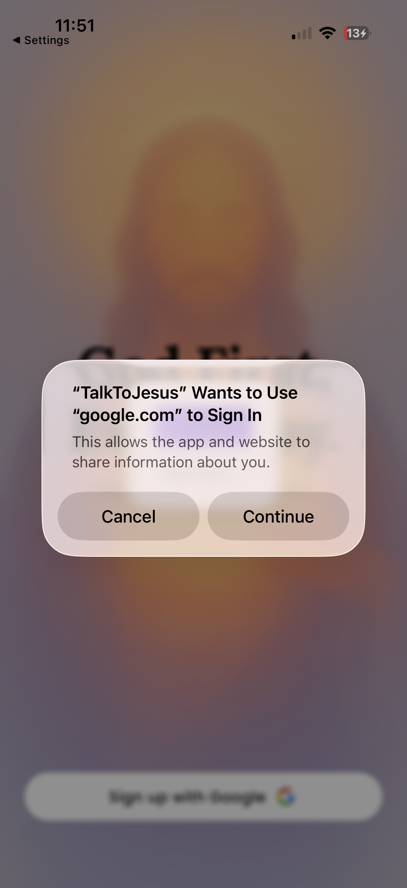
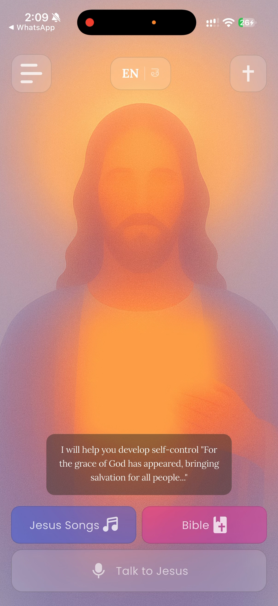
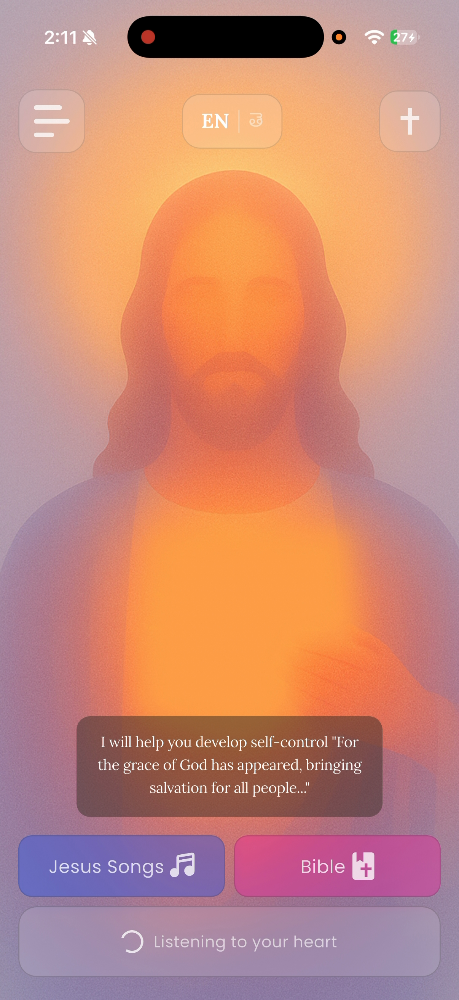
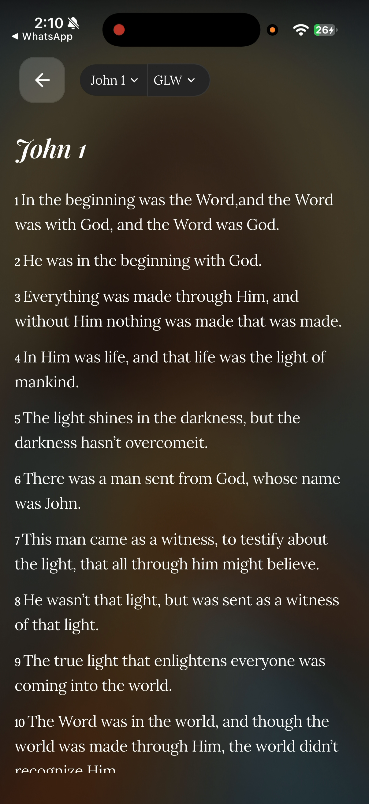
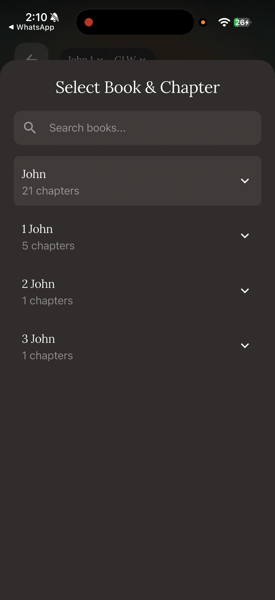
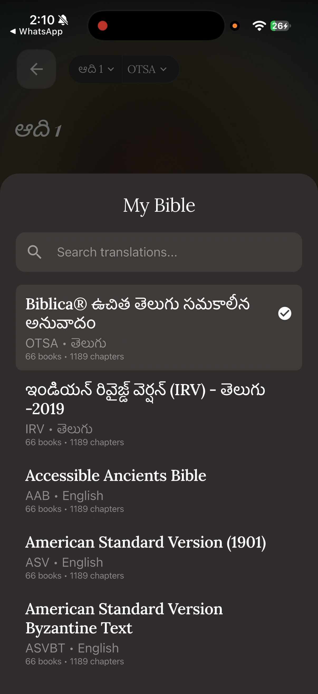
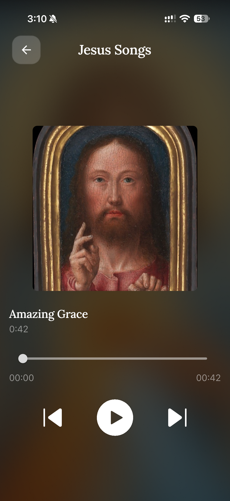

# User Manual

**TalkToJesus — A Bilingual Voice-First AI Spiritual Companion**

Manish Rachakonda (2023EBCS668) · BSc Computer Science (Online Mode) · BITS Pilani
Supervisor: Swapnil Saurav · Academic Year 2025–2026

This document is also included as Appendix A of the final project report. Figure numbers refer to that report; the figures themselves are indexed at `docs/figures/FIGURES.md`.

## A.1 Installing and starting

The application is not published to the App Store or Google Play. It is installed from a build supplied directly — an `.apk` on Android, or through TestFlight or a development build on iOS. On first launch it requests no permissions; the microphone is requested later, at the moment it is first needed.

## A.2 Signing in

The login screen shows a single control, **Sign up with Google** (Figure 1). Tap it, choose a Google account, and accept the consent prompt (Figure 2). The application creates an account on first sign-in and takes you to the home screen. There is no password to set or remember.

**Demonstration account.** Tapping the headline "God First, Every Day." five times reveals an additional **Enter with Demo Account** button. This exists for demonstrations and does not require a Google account.

## A.3 The home screen

The home screen (Figure 3) has four elements.

- **The menu button**, top left, opens your profile drawer.
- **The language toggle**, top centre, switches between **EN** and **తె**.
- **The status badge**, top right, shows subscription state: a green dot when a subscription is active, a crossed icon when it is not. Tapping the crossed icon opens the subscription options.
- **The voice bar**, along the bottom, is the main control. Above it sit two buttons, **Jesus Songs** and **Bible**.

## A.4 Having a conversation

1. Tap the voice bar labelled **Talk to Jesus**.
2. The first time, iOS or Android will ask for microphone permission. Allow it. If you previously denied it, the application offers to open system settings.
3. Recording begins (Figure 6). Speak naturally. There is no time limit, but keep it to a minute or so.
4. Tap the square **stop** button when finished, or the **×** to cancel without sending.
5. The bar shows *Listening to your heart* while the reply is prepared.
6. The reply appears as text and plays aloud automatically.

**Expect to wait.** A reply currently takes around 25 to 30 seconds. This is longer than intended; Section 3.5 of the main report explains why. The application has not frozen.

**Switching language.** Tap **EN | తె**. Every visible label changes immediately and the reply you receive next will be in the selected language (Figure 5). You do not need to restart.

**A note on what you will see.** Replies currently include bracketed words such as `[gently]` or `[prayerfully]`. These are instructions to the voice engine that were not meant to be displayed. They are a known defect (D-01) and do not form part of the message.

## A.5 Conversation history

Open the menu, top left, and choose **Conversation History** (Figure 8). Each card shows the language, how long ago the exchange happened, what you said and what was said in reply. Pull down to refresh. History is private to your account.

## A.6 Reading the Bible

Tap **Bible** on the home screen.

- **Change book or chapter** — tap the book name in the header, search or scroll, then pick a chapter from the grid (Figure 11).
- **Change translation** — tap the translation code in the header. Six are offered, including two in Telugu (Figure 10).
- Your position is remembered per book and translation, so returning takes you back where you were.
- Chapters you have already read remain available without a network.

## A.7 Listening to hymns

Tap **Jesus Songs** (Figure 13). Twelve hymns are bundled with the application and play without a network. Tap one to open the player (Figure 14), which offers play, pause and a seek bar.

**Known limitation.** The previous and next buttons in the player do not currently work (defect D-02). Go back to the list to change track.

## A.8 Subscribing

The first three conversations are free. After that the subscription sheet appears (Figure 15).

1. The plan is **₹499 per month** for twelve monthly cycles.
2. Tap it to open Razorpay checkout (Figure 16).
3. Enter a mobile number and email, then choose UPI, card or e-mandate.
4. Complete the payment in your UPI application if prompted.
5. On success you return to the application and the status badge turns green (Figures 17 and 18).

Payments are handled entirely by Razorpay. The application never sees your card or UPI credentials.

## A.9 Signing out

Open the menu and choose **Sign Out**. This clears the stored token from the device. Your conversation history is retained on the server and reappears when you sign back in.

## A.10 Troubleshooting

| Symptom | Likely cause | What to do |
|---|---|---|
| The voice bar does nothing | Microphone permission denied | Open system settings and enable the microphone for TalkToJesus |
| Reply takes 30 seconds | Expected behaviour today | Wait. See Section 3.5 of the main report |
| Reply arrives as text with no audio | Speech synthesis unavailable or disabled | The text reply is still correct. Try again later |
| "Subscription required" after three conversations | Free tier exhausted | Subscribe, or wait for an administrator to reset the counter |
| Payment succeeded but the badge is still inactive | Webhook not yet delivered | Reopen the application after a few seconds; a 24-hour grace period covers this window |
| Bible will not load | No network and the chapter is not cached | Connect to a network once; the chapter is then cached |
| Signed out unexpectedly | Token expired or was rejected | Sign in again |
| Hymns will not play | Audio routed elsewhere or device muted | Check the volume and any connected Bluetooth device |

## A.11 Frequently asked questions

**Is this a real person?** No. Replies are generated by a language model under a persona prompt. It is not a substitute for a pastor, a counsellor or a doctor.

**Should I rely on it in a crisis?** No. The persona is instructed to defer to human pastoral care for matters of crisis. Please contact a person you trust or an appropriate professional service.

**Are the scripture citations reliable?** They are generated by the model rather than retrieved from a verified corpus, and their accuracy was not formally verified (Section 3.8). Check any citation that matters to you.

**Who can see my conversations?** They are stored on the project's server and are visible to an administrator through the console. There is currently no retention policy or deletion path — this is a recorded limitation.

**Does it work offline?** The Bible reader and the hymn library do, once cached. Conversation requires a network.

**Can I type instead of speaking?** Not in this build. The capability exists in the API but has no interface.
